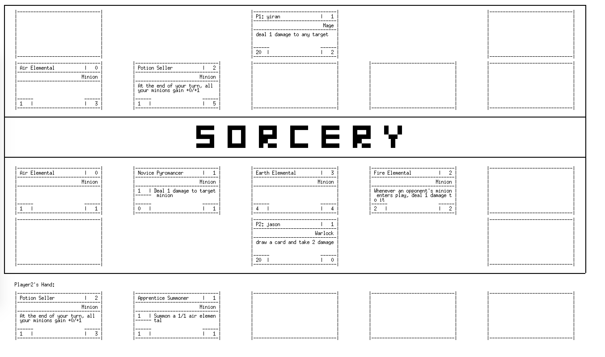

# Sorcery
## Introduction
Sorcery is a card game based on collectible card games such as “Hearthstone: Heroes of Warcraft” and “Magic: The Gathering”. The game is played on the terminal by entering commands, and it supports both text display and graphics display. Besides implementing all standard functionalities and cards, we also add the Hero Power feature to the game.

## Design
The game is implemented utilizing OOP(object-oriented programming) in C++. Several different design patterns including observer pattern, decorator pattern, MVC(model-view-controller) are used in the project order to improve the code-reusability and its resilience to change. Dynamic memory is managed through C++ smart pointers and the \<vector\> library.

## Instruction
The players need to give the commands in Linux. 
### Command Line Arguments
* -deck1 filename and -deck2 filename
 ** The argument _deck1 filename_ specifies that player 1's deck will be supplied in _filename_. If no argument is used to specified the deck, _default.deck_ is used. _deck2 filename_ works similarly. The file should only contain a list of card name.
* -init filename
 ** The game will be initialized using _filename_. _Filename_ consists of a sequence of commands to read from standard input before prompting the user for additional input (this includes player names and the selected Hero Powers).
* -testing
 ** The game will enter testing mode
 ** No limitations on magic
 ** Decks and Hero Powers are no longer randomized 
 ** Enables the following commands
   *** _discard i_: discard the ith card in player's hand
   *** _draw_: draw a card
* -graphics
 ** Enables a graphical interface utilizing XWindows graphics
* -disabletext
 ** Disable text display
* -disableheropower
 ** Disable Hero Power feature
### Command
* help -- Display this message.
* end  -- End the current player's turn.
* quit -- End the game.
* attack minion other-minion -- Orders minion to attack other-minion.
* attack minion -- Orders minion to attack the opponent.
* play card \[target-player target-card] -- Play card, optionally targeting target-card owned by target-player.
* use minion \[target-player target-card] -- Use minion's special ability, optionally targeting target-card owned by target-player.
* inspect minion -- View a minion's card and all enchantments on that minion.
* hand -- Describe all cards in your hand.
* board -- Describe all cards on the board.
* usepower \[target-player target-card] -- use hero power, optionally targeting target-player or target-card owned by target-player.
